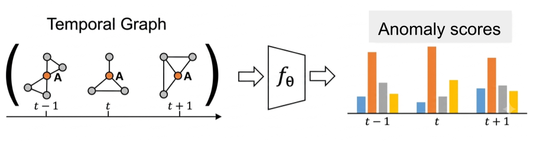
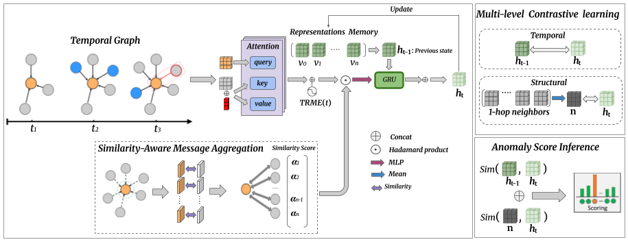
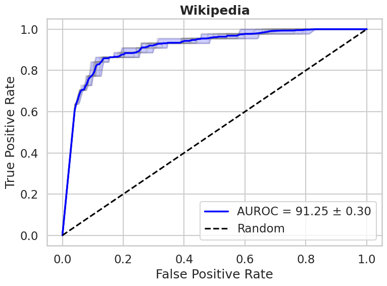
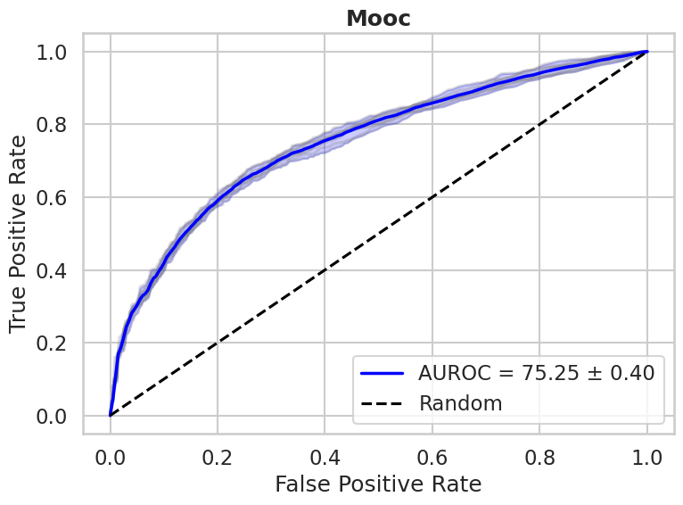
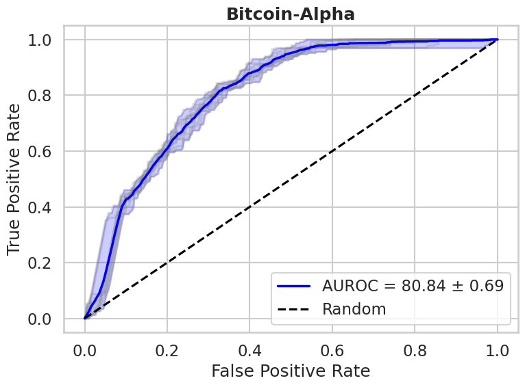
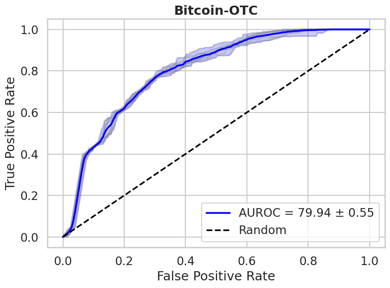
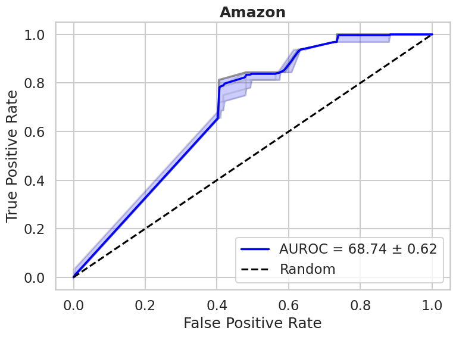

# A Time-Aware Self-Supervised Framework for Anomaly Detection in Temporal Graphs
This is the code for **[A Time-Aware Self-Supervised Framework for Anomaly Detection in Temporal Graphs](https://github.com/slitiWassim/NFT-Suspicious-Activity)** .

[](https://www.apache.org/licenses/LICENSE-2.0)
[](https://www.python.org/downloads/)
[](https://pytorch.org/)
[](https://pytorch-geometric.readthedocs.io/en/2.7.0/install/installation.html)

### [🌐 Project](https://slitiwassim.github.io/T-ADTG/) | [📄 Paper]()


<p align="center">
  <a href="static/images/paper_.png" target="_blank">
    
  </a>
</p>


## Setup
The code can be run under any environment with Python 3.9.25 and above.
(It may run with lower versions, but we have not tested it).


Clone this repo:

    git clone https://github.com/slitiWassim/T-ADTG.git
    cd T-ADTG/


Install the required packages:

    pip install -r requirements.txt
  

## Framework Overview

<p align="center">
  <a href="static/images/T-ADTG.png" target="_blank">
    
  </a>
</p>


We evaluate `T-ADTG` on:
| Dataset | Link                                                                                  |
|--|---------------------------------------------------------------------------------------|
| Wikipedia | [](https://snap.stanford.edu/jodie/) |
|  Mooc | [](https://snap.stanford.edu/jodie/) |
| Bitcoin-Alpha  | [](https://snap.stanford.edu/data/soc-sign-bitcoin-alpha.html) |
| Bitcoin-OTC  | [](https://snap.stanford.edu/data/soc-sign-bitcoin-otc.html)|
| Amazon | [](https://www.kaggle.com/datasets/snap/amazon-fine-food-reviews)|


A dataset is a directory with the following structure:
  ```bash
  $ tree data
  NFTs_Dataset
  ├── mapping
  │   ├── nft_id_mapping
  │   └── wallet_id_mapping
  │
  ├── collections.csv
  └── opensea_nft_transactions.parquet
  
  
  ```


## Baselines

| **Baseline** |  **Paper** |  **Code** |
|----------|:--------:|:--------------------------------------------------------------:|
| **Radar** | <a href="https://www.ijcai.org/proceedings/2017/0299.pdf"></a> | <a href="https://docs.pygod.org/en/latest/generated/pygod.detector.Radar.html"></a> |
| **DOMINANT** | <a href="https://epubs.siam.org/doi/10.1137/1.9781611975673.67"></a> | <a href="https://docs.pygod.org/en/latest/generated/pygod.detector.DOMINANT.html"></a> |
| **GDN** | <a href="https://dl.acm.org/doi/10.1145/3442381.3449922"></a> | <a href="https://github.com/kaize0409/Meta-GDN_AnomalyDetection/tree/main"></a> |
| **SemiGNN** | <a href="https://ieeexplore.ieee.org/document/8970829"></a> | <a href="https://github.com/safe-graph/DGFraud/tree/master"></a> |
| **F-FADE** | <a href="https://dl.acm.org/doi/10.1145/3437963.3441806"></a> | <a href="https://github.com/snap-stanford/F-FADE"></a> |
| **NetWalk** | <a href="https://dl.acm.org/doi/10.1145/3219819.3220024"></a> | <a href="https://github.com/chengw07/NetWalk"></a> |
| **AddGraph** | <a href="https://www.ijcai.org/proceedings/2019/614"></a> | <a href="https://github.com/Ljiajie/Addgraph"></a> |
| **DyRep** | <a href="https://openreview.net/pdf?id=HyePrhR5KX"></a> | <a href="https://github.com/twitter-research/tgn/tree/master"></a> |
| **TADDY** | <a href="https://ieeexplore.ieee.org/document/9599560/"></a> | <a href="https://github.com/yuetan031/TADDY_pytorch/tree/main"></a> |
| **JODIE** | <a href="https://dl.acm.org/doi/10.1145/3292500.3330895"></a> | <a href="https://github.com/twitter-research/tgn/tree/master"></a> |
| **TGAT** | <a href="https://openreview.net/forum?id=rJeW1yHYwH"></a> | <a href="https://github.com/StatsDLMathsRecomSys/Inductive-representation-learning-on-temporal-graphs"></a> |
| **TGN** | <a href="https://arxiv.org/abs/2006.10637"></a> | <a href="https://github.com/twitter-research/tgn/tree/master"></a> |
| **SAD** | <a href="https://www.ijcai.org/proceedings/2023/256"></a> | <a href="https://github.com/D10Andy/SAD"></a> |
| **SLADE** | <a href="https://dl.acm.org/doi/pdf/10.1145/3637528.3671845"></a> | <a href="https://github.com/jhsk777/SLADE"></a> |
| **MHisCL** | <a href="https://doi.org/10.1016/j.knosys.2025.113049"></a> | <a href="https://github.com/Yun-Fu/MHisCL"></a> |


## Training
To train `Drone-Guard` on a dataset, run:
```bash
 python  train.py \
      --cfg <config-file>  \
      --exp <experiment-name>  \
      --gpu <experiment-name> 
```  
 For example, to train `Drone-Guard` on Ped2:

```bash
python train.py \
    --cfg config/wikipedia.yaml # To Train model with both normal and pseudo anomalies data
```

## Configuration
 * We use [YAML](https://yaml.org/) for configuration.
 * We provide a couple preset configurations.
 * Please refer to `config.py` for documentation on what each configuration does.

## Results 

<p align="center">
  
  
  
</p>

<p align="center">
  
  
</p>
<p align="center">
Mean ROC curves of <b>T-ADTG</b> on the five benchmark datasets, averaged over 10 runs. Each panel reports the mean AUROC and its standard deviation.
</p>

## Citing
If you find our work useful, please consider citing:
```BibTeX
The paper has been submitted and is currently under review.

```

## Contact
For any question, please file an [issue](https://github.com/slitiWassim/NFT-Suspicious-Activity/issues) or contact:

    Wassim Sliti : wassim.sliti@upm.es

## Acknowledgement

This work was carried out within the STRAST Research Group at the Information Processing and Telecommunications Center (IPTC), Universidad Politécnica de Madrid, as part of the [ CEDAR ](https://cedar-heu-project.eu/)   project, funded by the Horizon Europe Programme (Grant Agreement No. 101135577). 
